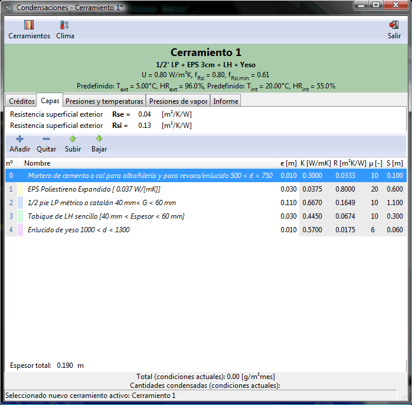

Condensaciones
==============

**Condensaciones** es una aplicación que permite realizar el **cálculo de los parámetros higrotérmicos** de cerramientos y la **comprobación de la existencia de condensaciones** *superficiales* o *intersticiales*.

La aplicación ha sido desarrollada por `Rafael Villar Burke`_.

Esta documentación corresponde a la versión |release| (|today|).

Documentación
=============

.. toctree::
   :maxdepth: 3

   sobre_condensaciones
   manual_usuario
   referencia_programacion

.. note::

    Condensaciones se distribuye con la esperanza de que resulte útil, pero SIN NINGUNA GARANTÍA, ni garantía MERCANTIL implícita, ni la CONVENIENCIA PARA UN PROPÓSITO PARTICULAR.

.. _Rafael Villar Burke: http://www.rvburke.com
