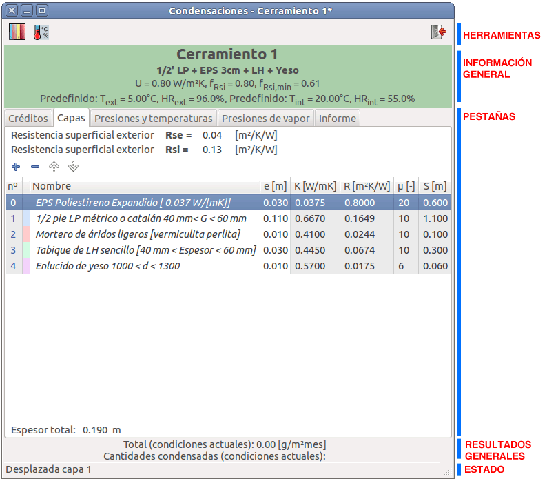
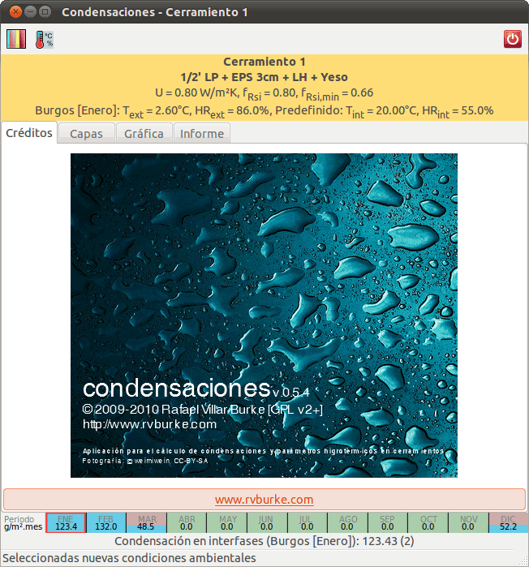
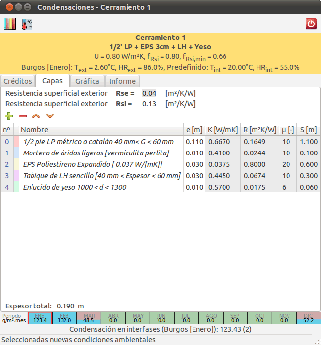
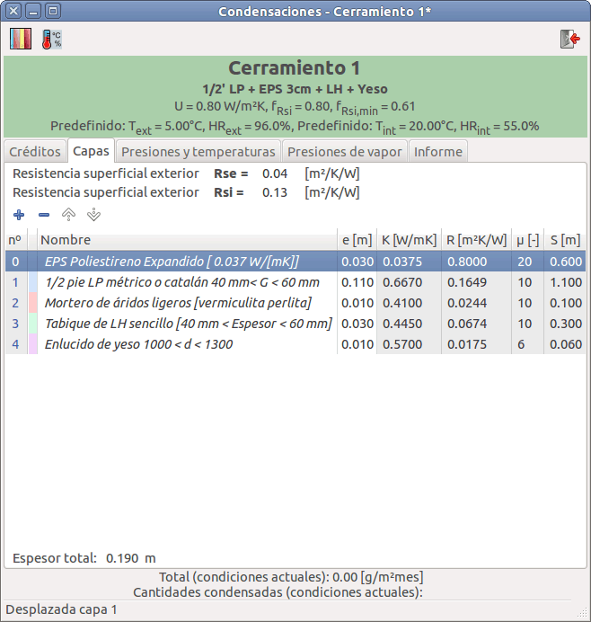
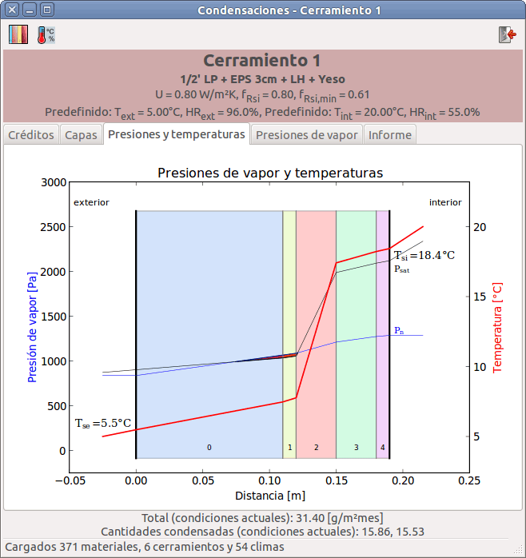
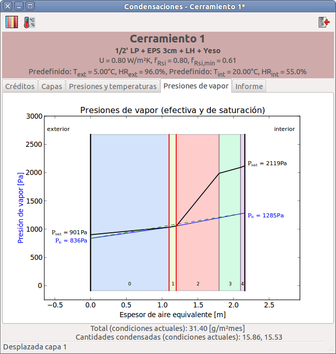
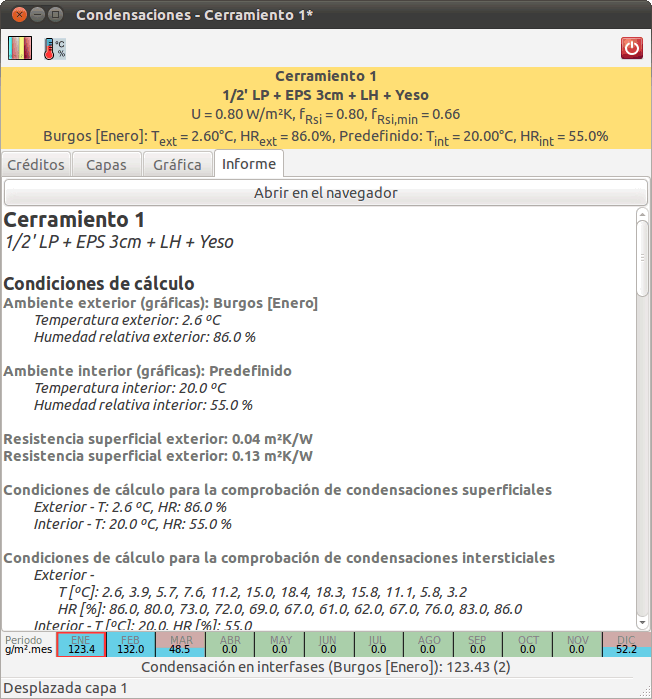
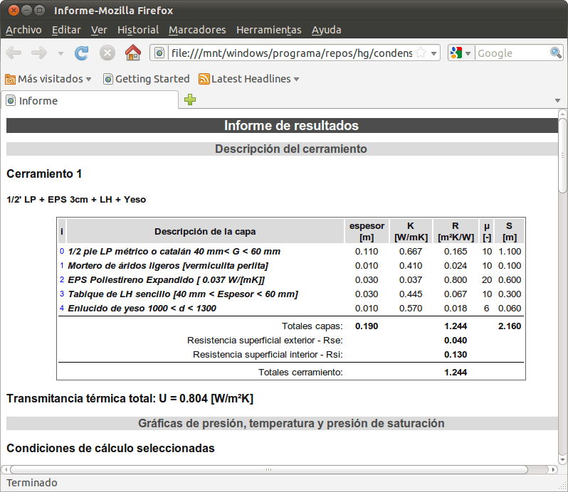

.. Hacer pantallazos de nuevo y comprobar por qué en Linux no se ve el nombre del cerramiento en la barra de información general.

.. _manual_usuario:
=============================================================================
                            Manual del usuario
=============================================================================

.. _instalacion:
Instalación de la aplicación
============================

La forma más habitual de instalar Condensaciones es utilizando uno de los
instaladores preparados para su sistema operativo.

Si no hay un instalador disponible o quiere hacer una instalación a partir de
las fuentes, entonces necesita instalar un intérprete de Python_ y las
siguientes bibliotecas:

- Python_ 2.6
- PyGTK_ 2.22.0
- PyGObject_ 2.26.0
- PyCairo_ 1.18.10
- Numpy_ 1.4.0
- Matplotlib_ 1.0.0
- ConfigObj_ 4.7.2

Para generar la documentación es necesario instalar el paquete Sphinx_ (v1.0.4) y
para los test el paquete unittest2_ (v0.5.1). Los instaladores se generan
utilizando distribute_ (0.6.14), PIL_ 1.1.7 para los gráficos y py2exe_ y NSIS_
para los instaladores de Windows.

.. _Python: http://www.python.org
.. _PyGTK: http://www.pygtk.org
.. _PyGObject: http://www.pygtk.org
.. _PyCairo: http://www.pygtk.org
.. _Numpy: http://numpy.scipy.org/
.. _Matplotlib: http://matplotlib.sourceforge.net
.. _ConfigObj: http://www.voidspace.org.uk/python/configobj.html
.. _Sphinx: http://sphinx.pocoo.org/
.. _unittest2: http://pypi.python.org/pypi/unittest2
.. _distribute: http://pypi.python.org/pypi/distribute
.. _PIL: http://www.pythonware.com/products/pil/
.. _py2exe: http://www.py2exe.org/
.. _NSIS: http://nsis.sourceforge.net/

.. _conversion_materiales:
Conversión de bases de datos de materiales
==========================================

Condensa incluye una aplicación auxiliar que permite convertir bases de datos
que utilicen el formato de LIDER_/CALENER_ al formato propio de la aplicación.

.. Pendiente de acabar. Indicar cómo se usa.

.. _interfaz_usuario:
Interfaz de usuario
===================

.. _ui_organizacion_general:
Organización general de la interfaz
-----------------------------------

La interfaz de la aplicación organiza el contenido en zonas o bandas para
facilitan su uso y localizar más rápidamente la información relevante.

Estas zonas son:

- Barra de herramientas
- Barra de información general
- Pestaña de datos
- Barra de resultados generales
- Barra de estado

.. _ui_herramientas:

Barra de herramientas
---------------------

La barra de herramientas contiene los botones de acceso al diálogo de la
biblioteca de cerramientos y al diálogo de definición de climas (interior y
exterior).

.. _ui_infogeneral:

Barra de información general
----------------------------

La barra de información general permite conocer el cerramiento activo y los
parámetros de cálculo activos.

Los datos se organizan en tres líneas de texto:

- el **nombre** del cerramiento.
- la **descripción** del cerramiento (según esté almacenado en la biblioteca).
- los **parámetros higrotérmicos** más relevantes (transmitancia térmica
  `U` , factor de temperatura de la superficie interior `fRsi` y
  factor de temperatura de la superficie interior mínimo `fRsi,min`).
- los valores de **humedad relativa** y **temperatura** exterior e interior
  usados en el cálculo.

Además, el fondo de esta zona es verde si el cerramiento está libre de
condensaciones, o rojo si se producen condensaciones en su interior.

.. _ui_pestañas:

Pestañas de datos
-----------------

Esta zona incluye información más detallada en varias pestañas:

- Créditos de la aplicación o pantalla de bienvenida
- Descripción y gestión de las capas del cerramiento
- Diagrama de presiones y temperaturas
- Diagrama de presiones de vapor
- Informe de cálculos y resultados

.. _ui_creditos:

Pantalla de bienvenida
~~~~~~~~~~~~~~~~~~~~~~

La aplicación se inicia con la pestaña de créditos activada y con el
cerramiento predeterminado seleccionado.

En los créditos se detalla la versión, la licencia de distribución y los datos
de autoría, además de darse acceso a la web de la aplicación a través de un
botón de enlace que arranca el navegador.

.. _ui_capas:

Gestión de capas
~~~~~~~~~~~~~~~~

En esta pestaña es posible modificar la composición del cerramiento. Se pueden
agregar o eliminar capas, así como reordenarlas, usando los botones de la barra
superior y cambiar el espesor o el material de una capa, editando directamente
esos valores en la lista.

La lista de capas se ordena del exterior al interior y muestra los siguientes
datos de cada capa:

- número de capa (empezando en 0)
- color asignado a la capa en las gráficas
- nombre de la capa
- espesor de la capa [m]
- conductividad térmica de la capa [W/mK]
- resistencia térmica de la capa [m²K/W]
- difusividad al vapor de agua [adimensional]
- espesor de aire equivalente [m]

Las resistencias superficiales de las caras exterior e interior se muestran y
pueden ser editados en campos de entrada independientes, sobre la lista de
capas.

El espesor total del cerramiento se indica en la parte inferior de la lista.

Los cambios realizados en la lista de capas tienen efecto inmediato y provocan
la actualización de la barra de información general y de resultados con los
valores de condensación correspondientes.

En la imagen siguiente se puede apreciar cómo el cerramiento del ejemplo ha
dejado de sufrir condensaciones al trasladar la capa de aislamiento intermedio
al exterior:

.. _ui_gprestemp:

Diagrama de presiones y temperaturas
~~~~~~~~~~~~~~~~~~~~~~~~~~~~~~~~~~~~

Se representa el cerramiento, con espesores geométricos de las capas y una
superposición de las líneas de presiones y temperaturas en el interior del
cerramiento.

La línea de temperaturas se dibuja en rojo, la de presiones de vapor en azul, y
en negro se indica la presión de vapor de saturación. En caso de existir
condensaciones, se indica la zona afectada mediante un relleno en color rojo
entre las líneas de presiones.

.. _ui_gvapor:

Diagrama de presiones de vapor
~~~~~~~~~~~~~~~~~~~~~~~~~~~~~~

Se representa el cerramiento con espesores de aire equivalente de cada capa,
superponiendo la gráfica de presiones de vapor en el interior del cerramiento.

La línea de presiones de vapor efectiva en cada capa se representa en trazo
azul y la presión de vapor de saturación en una línea negra más gruesa.

En caso de condensaciones se indica en línea de trazos la línea de presiones de
vapor en ausencia de condensaciones. Además, se resaltan con una línea gruesa
en rojo las interfases en las que se producen las condensaciones.

.. _ui_informe:

Informe de resultados
~~~~~~~~~~~~~~~~~~~~~

El informe de resultados incluye la información necesaria para la comprobación
del cerramiento:

- Nombre y descripción del cerramiento.
- Condiciones de humedad y temperatura usadas en los cálculos.
- Parámetros de cálculo de las distintas capas y de resistencia superficial.
- Parámetros higrotérmicos del cerramiento compuesto.
- Gráficas de temperatura y presión efectiva y de presiones efectivas y de
  saturación.
- Comprobaciones para la existencia de condensaciones superficiales e
  intersticiales según CTE.

Para poder imprimir el informe, guardarlo en disco y para su copia en el
portapapeles, se dispone de un botón en la parte superior que abre una versión
del informe en el navegador web que tenga configurado el sistema.

.. _ui_resultados:

Barra de resultados generales
-----------------------------

Esta zona recoge la cantidad total de vapor condensado (en g/m²mes) y su
distribución en capas.

.. _ui_estado:

Barra de estado
---------------

La barra de estado indica la última operación realizada e información
relacionada con ella.

