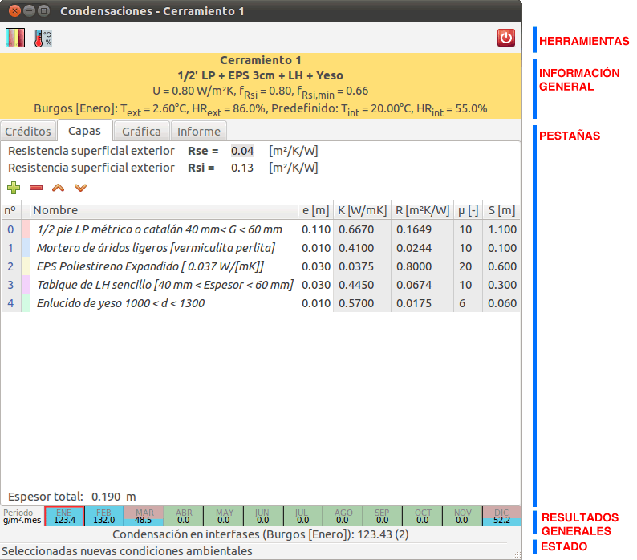
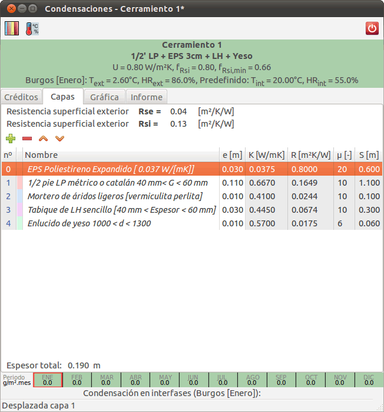
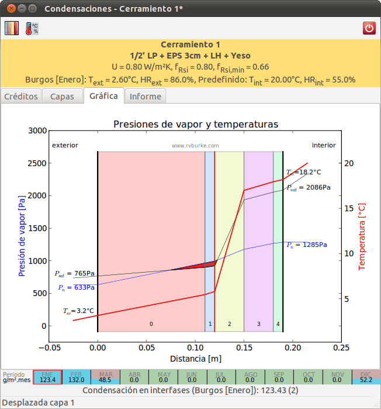

.. Hacer pantallazos de nuevo y comprobar por qué en Linux no se ve el nombre del cerramiento en la barra de información general.

.. _manual_usuario:

=============================================================================
                            Manual del usuario
=============================================================================

.. _instalacion:

Instalación de la aplicación
============================

La forma más habitual de instalar **Condensaciones** es mediante uno de los instaladores disponibles en la `página de descargas del proyecto`_.

Los instaladores para el sistema operativo Windows generan los enlaces correspondientes a la aplicación en el menú de inicio. Estos instaladores se han obtenido usando py2exe_ y NSIS_.

Si no existe un instalador disponible para su sistema operativo, o desea llevar a cabo una instalación a partir del código fuente, necesita instalar las siguientes dependencias:

- Python_ 2.6
- PyGTK_ 2.22.0
- PyGObject_ 2.26.0
- PyCairo_ 1.18.10
- Numpy_ 1.4.0
- Matplotlib_ 1.0.0
- ConfigObj_ 4.7.2

Una vez instaladas las dependencias puede hacer funcionar **Condensaciones** llamando directamente al script ``bin/condensa`` desde una carpeta que contenga una copia del código fuente::

    $ python bin/condensa

La aplicación detecta automáticamente si se está ejecutando desde una versión de un instalador o directamente y ajustará las rutas de búsqueda de sus bases de datos.

Para generar la documentación es necesario Sphinx_ (v1.0.4) y, para los test, el paquete unittest2_ (v0.5.1).

Para generar automáticamente las imágenes de las pantallas de bienvenida se utiliza PIL_ (v1.1.7), y distribute_ (v0.6.14), py2exe_ y NSIS_ para obtener los instaladores de Windows.

.. _conversion_materiales:

Conversión de bases de datos de materiales
==========================================

Para almacenar los datos de las propiedades de los materiales la aplicación utiliza un formato simple de texto que resulta fácilmente editable. Además, el formato incluye información sobre los campos existentes y su uso.

Para facilitar el uso desde otras bases de datos, **Condensaciones** incluye la aplicación de línea de comandos ``importDB``, que permite convertir bases de datos en formato LIDER_/CALENER_ al formato nativo de la aplicación.

El siguiente ejemplo::

    $ importDB BDCatalogo.bdc

importa los datos del archivo ``BDCatalogo.bdc`` y los exporta al archivo ``DB.ini``.

La aplicación permite convertir varios archivos a una única base de datos y admite opciones para definir un archivo de salida diferente. Puede consultar estas opciones en el texto de ayuda que muestra al arranca la aplicación sin parámetros.

.. _bibliotecas_predefinidas:

Bibliotecas predefinidas (materiales, cerramientos y climas)
============================================================

**Condensaciones** se distribuye con una base de datos de materiales de ejemplo (``MaterialesDB``), obtenida de la conversión del archivo de materiales de LIDER_ usando la aplicación ``importDB``.

También incluye una base de datos de cerramientos (``CerramientosDB``) y una base de datos de climas (``ClimaCTE``) con los datos climáticos de las capitales de provincia españolas, según el `Código Técnico de la Edificación (CTE)`_.

Estas bibliotecas se encuentran en el directorio ``data`` de la aplicación.

.. _interfaz_usuario:

Interfaz de usuario
===================

**Condensa** es una aplicación gráfica que intenta ofrecer una interfaz ágil e intuitiva.

.. _ui_organizacion_general:

Organización general de la interfaz
-----------------------------------

La interfaz de la aplicación organiza el contenido en zonas o bandas para facilitan su uso y localizar más rápidamente la información relevante.

Estas zonas son:

- Barra de herramientas
- Barra de información general
- Pestaña de datos
- Barra de resultados generales
- Barra de estado

.. _ui_herramientas:

Barra de herramientas
---------------------

La barra de herramientas contiene los botones de acceso al diálogo de la biblioteca de cerramientos y al diálogo de definición de climas (interior y exterior).

.. _ui_infogeneral:

Barra de información general
----------------------------

La barra de información general permite conocer el cerramiento activo y los parámetros de cálculo activos.

Los datos se organizan en tres líneas de texto:

- el **nombre** del cerramiento.
- la **descripción** del cerramiento (según esté almacenado en la biblioteca).
- los **parámetros higrotérmicos** más relevantes (transmitancia térmica `U` , factor de temperatura de la superficie interior `fRsi` y factor de temperatura de la superficie interior mínimo `fRsi,min`).
- los valores de **humedad relativa** y **temperatura** exterior e interior usados en el cálculo.

Además, el fondo de esta zona es *verde* si el cerramiento está libre de condensaciones, *anaranjado* si se producen condensaciones intersticiales o superficiales, o *rojo* si se producen condensaciones superficiales e intersticiales en el cerramiento.

.. _ui_pestañas:

Pestañas de datos
-----------------

Esta zona incluye información más detallada en varias pestañas:

- Créditos de la aplicación o pantalla de bienvenida
- Descripción y gestión de las capas del cerramiento
- Diagrama de presiones y temperaturas
- Diagrama de presiones de vapor
- Informe de cálculos y resultados

.. _ui_creditos:

Pantalla de bienvenida
~~~~~~~~~~~~~~~~~~~~~~

La aplicación se inicia con la pestaña de créditos activada y con el cerramiento predeterminado seleccionado.

En los créditos se detalla la versión, la licencia de distribución y los datos de autoría, además de darse acceso a la web de la aplicación a través de un botón de enlace que arranca el navegador.

.. figure:: _static/pantallazos/ui_01_creditos.png
   :align: center
   :scale: 75%

.. _ui_capas:

Gestión de capas
~~~~~~~~~~~~~~~~

En esta pestaña es posible modificar la composición del cerramiento. Se pueden agregar o eliminar capas, así como reordenarlas, usando los botones de la barra superior y cambiar el espesor o el material de una capa, editando directamente esos valores en la lista.

La lista de capas se ordena del exterior al interior y muestra los siguientes datos de cada capa:

- número de capa (empezando en 0)
- color asignado a la capa en las gráficas
- nombre de la capa
- espesor de la capa [m]
- conductividad térmica de la capa [W/mK]
- resistencia térmica de la capa [m²K/W]
- difusividad al vapor de agua [adimensional]
- espesor de aire equivalente [m]

Las resistencias superficiales de las caras exterior e interior se muestran y pueden ser editados en campos de entrada independientes, sobre la lista de capas.

El espesor total del cerramiento se indica en la parte inferior de la lista.

Los cambios realizados en la lista de capas tienen efecto inmediato y provocan la actualización de la barra de información general y de resultados con los valores de condensación correspondientes.

En la imagen siguiente se puede apreciar cómo el cerramiento del ejemplo ha dejado de sufrir condensaciones al trasladar la capa de aislamiento intermedio al exterior:

.. _ui_gprestemp:

Diagrama de presiones y temperaturas
~~~~~~~~~~~~~~~~~~~~~~~~~~~~~~~~~~~~

Se representa el cerramiento, con espesores geométricos de las capas y una superposición de las líneas de presiones y temperaturas en el interior del cerramiento.

La línea de temperaturas se dibuja en rojo, la de presiones de vapor en azul, y en negro se indica la presión de vapor de saturación. En caso de existir condensaciones, se indica la zona afectada mediante un relleno en color rojo entre las líneas de presiones.

.. _ui_gvapor:

Diagrama de presiones de vapor
~~~~~~~~~~~~~~~~~~~~~~~~~~~~~~

Se representa el cerramiento con espesores de aire equivalente de cada capa, superponiendo la gráfica de presiones de vapor en el interior del cerramiento.

La línea de presiones de vapor efectiva en cada capa se representa en trazo azul y la presión de vapor de saturación en una línea negra más gruesa.

En caso de condensaciones se indica en línea de trazos la línea de presiones de vapor en ausencia de condensaciones. Además, se resaltan con una línea gruesa en rojo las interfases en las que se producen las condensaciones.

.. figure:: _static/pantallazos/ui_05_vapor.png
   :align: center
   :scale: 75%

.. _ui_informe:

Informe de resultados
~~~~~~~~~~~~~~~~~~~~~

El informe de resultados incluye la información necesaria para la comprobación del cerramiento:

- Nombre y descripción del cerramiento.
- Condiciones de humedad y temperatura usadas en los cálculos.
- Parámetros de cálculo de las distintas capas y de resistencia superficial.
- Parámetros higrotérmicos del cerramiento compuesto.
- Gráficas de temperatura y presión efectiva y de presiones efectivas y de saturación.
- Comprobaciones para la existencia de condensaciones superficiales e intersticiales según CTE.

Para poder imprimir el informe, guardarlo en disco y para su copia en el portapapeles, se dispone de un botón en la parte superior que abre una versión del informe en el navegador web que tenga configurado el sistema.

.. _ui_resultados:

Barra de resultados generales
-----------------------------

Esta zona recoge la cantidad total de vapor condensado (en g/m²mes) y su distribución en capas.

.. _ui_estado:

Barra de estado
---------------

La barra de estado indica la última operación realizada e información relacionada con ella.

.. _página de descargas del proyecto: https://bitbucket.org/pachi/condensaciones/downloads
.. _Python: http://www.python.org
.. _PyGTK: http://www.pygtk.org
.. _PyGObject: http://www.pygtk.org
.. _PyCairo: http://www.pygtk.org
.. _Numpy: http://numpy.scipy.org/
.. _Matplotlib: http://matplotlib.sourceforge.net
.. _ConfigObj: http://www.voidspace.org.uk/python/configobj.html
.. _Sphinx: http://sphinx.pocoo.org/
.. _unittest2: http://pypi.python.org/pypi/unittest2
.. _distribute: http://pypi.python.org/pypi/distribute
.. _PIL: http://www.pythonware.com/products/pil/
.. _py2exe: http://www.py2exe.org/
.. _NSIS: http://nsis.sourceforge.net/
.. _LIDER: http://www.codigotecnico.org/cte/opencms/web/recursos/aplicaciones/contenido/texto_0002.html
.. _CALENER: http://www.mityc.es/energia/desarrollo/EficienciaEnergetica/CertificacionEnergetica/ProgramaCalener/Paginas/DocumentosReconocidos.aspx
.. _Código Técnico de la Edificación (CTE): http://www.codigotecnico.org/
